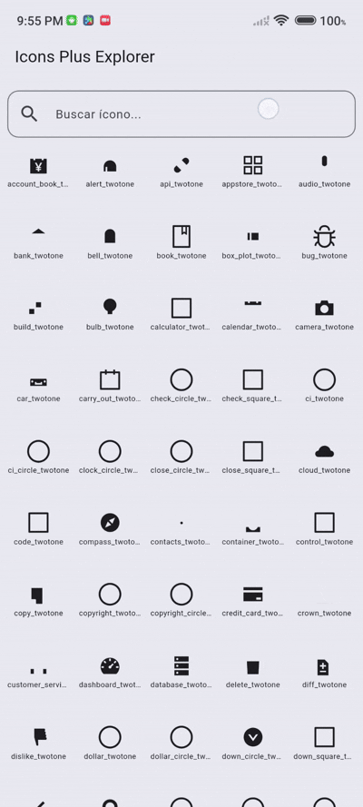

# Icons Plus Explorer



**Icons Plus Explorer** es una aplicación Flutter que permite explorar más de 15 librerías de íconos populares, como FontAwesome, Bootstrap, AntDesign, BoxIcons, EvaIcons, y muchas más. La aplicación facilita la búsqueda, visualización y copia de los íconos para su uso en proyectos Flutter.

---

## Características

- 🔍 **Búsqueda en tiempo real** de más de 15 librerías de íconos.
- 🖼 **Vista en cuadrícula** de todos los íconos disponibles.
- ℹ️ **Información detallada** de cada ícono:  
  - Nombre del ícono  
  - Llamado para Flutter (`Bootstrap.circle`, `FontAwesome.youtube_brand`, etc.)
- 📋 **Copia rápida al portapapeles** del llamado del ícono (opcional, si se implementa).
- 💻 **Compatibilidad con Flutter 3+** y Material 3.

---

## Librerías de íconos incluidas

- AntDesign  
- Bootstrap  
- BoxIcons  
- Clarity  
- EvaIcons  
- FontAwesome  
- HeroIcons  
- Iconsax  
- IonIcons  
- LineAwesome  
- MingCute  
- OctIcons  
- PixelArtIcons  
- TeenyIcons  
- ZondIcons  

---

## Instalación

Hay dos formas de instalar la aplicación:

### Opción 1: Desde el repositorio

1. Clona el repositorio:

```bash
git clone https://github.com/tu-usuario/icons-plus-explorer.git
cd icons-plus-explorer
```


2. Instala las dependencias:

```bash
flutter pub get
```

3. Corre la aplicación:

```bash
flutter run
```


### Opción 2: Descargar el release

1. Ve a la sección [Releases](https://github.com/CapiFrank/icons_plus_explorer/releases/tag/v0.1.0)

 del repositorio.

2. Descarga el archivo apk.

3. Ejecuta la aplicación descargada directamente.

---
## Uso

1. Abre la app y utiliza la barra de búsqueda para encontrar un ícono específico.

2. Selecciona un ícono para ver su nombre y cómo llamarlo en Flutter.

---
## Contribuciones
### Si quieres contribuir:
1. Haz un fork del proyecto

2. Crea tu branch: 
```bash
git checkout -b feature/nueva-funcionalidad
```

3. Haz commit de tus cambios:
```bash
git commit -m 'Agrega nueva funcionalidad'
``` 

4. Haz push a la rama: 
```bash
git push origin feature/nueva-funcionalidad
``` 

5. Abre un Pull Request
